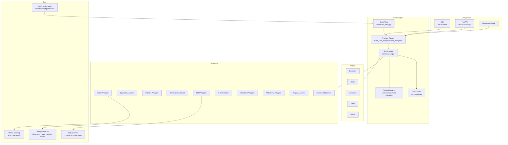

# Skill Scanner Architecture

## Overview

Skill Scanner is a modular security scanner for agent skill packages. It supports local skill formats used by OpenAI Codex Skills and Cursor Agent Skills, and combines deterministic scanning with optional LLM-assisted analysis.

The implementation is organized around a central scanner orchestrator plus pluggable analyzers:

- **Core analyzers (enabled by policy):** static, bytecode, pipeline
- **Optional analyzers (enabled by flags/API params):** behavioral, LLM, meta, VirusTotal, AI Defense, trigger
- **Shared policy system:** controls thresholds, scoping, overrides, and output normalization

## High-Level Layout

## Core Components

### Data Models (`skill_scanner/core/models.py`)

Primary data structures:

- `SkillManifest`, `SkillFile`, `Skill`
- `Finding`, `ScanResult`, `Report`
- enums: `Severity`, `ThreatCategory`

`ScanResult` and `Report` expose computed safety/severity summaries and JSON-serializable output helpers.

### Loader (`skill_scanner/core/loader.py`)

`SkillLoader` is responsible for:

1. Validating skill directory and `SKILL.md`
2. Parsing frontmatter (`name`, `description`, optional metadata)
3. Discovering files recursively (excluding only `.git` internals)
4. Basic file-type classification (python/bash/markdown/binary/other)
5. Extracting referenced file hints from instruction content

### Analyzer Construction (`skill_scanner/core/analyzer_factory.py`)

This is the single source of truth for analyzer assembly:

- `build_core_analyzers(policy, ...)`
  - static, bytecode, pipeline (gated by `policy.analyzers.*`)
- `build_analyzers(policy, ..., use_behavioral/use_llm/...)`
  - adds optional analyzers based on flags/params

CLI, API, pre-commit hook, eval runners, and fallback scanner paths all rely on this factory for parity.

### Scanner Orchestrator (`skill_scanner/core/scanner.py`)

`SkillScanner` runs a two-phase scan pipeline for each skill:

1. **Load + preprocess**
   - load skill
   - extract archives/embedded content via `ContentExtractor`
2. **Phase 1 analyzers (non-LLM)**
   - static/bytecode/pipeline and other non-LLM analyzers
3. **Phase 2 analyzers (LLM/meta)**
   - run LLM analyzers with enrichment context from phase-1 findings
4. **Post-processing**
   - policy `disabled_rules` enforcement
   - severity overrides
   - analyzability scoring + analyzability findings
   - finding dedupe/collapse/metadata annotations
   - policy fingerprint metadata attachment
5. **Finalize**
   - cleanup temporary extraction artifacts
   - return `ScanResult`

For directory scans, `scan_directory(...)` iterates skill packages and optionally adds:

- description overlap findings (`TRIGGER_OVERLAP_*`)
- cross-skill findings via `CrossSkillScanner`

## Analyzer Inventory

### Core (policy-driven)

- `static_analyzer`: YAML signatures + YARA + inventory checks
- `bytecode_analyzer`: Python bytecode/source consistency checks
- `pipeline_analyzer`: shell pipeline taint analysis and command-risk checks

### Optional (flag/API-driven)

- `behavioral_analyzer`: static dataflow + cross-file/script correlation
- `llm_analyzer`: semantic threat analysis with structured schema output
- `meta_analyzer`: second-pass LLM validation/filtering (requires prior findings)
- `virustotal_analyzer`: binary hash lookup (+ optional upload)
- `aidefense_analyzer`: Cisco AI Defense cloud inspection
- `trigger_analyzer`: overly broad trigger/description checks

## Policy System

`ScanPolicy` (`skill_scanner/core/scan_policy.py`) centralizes:

- file limits and thresholds
- rule scoping and docs-path behavior
- command safety tiers
- hidden file allowlists
- severity overrides and disabled rules
- output dedupe and metadata behavior
- core analyzer toggles

Built-in presets:

- `strict`
- `balanced` (default)
- `permissive`

## Entry Points

### CLI (`skill_scanner/cli/cli.py`)

Commands:

- `scan`
- `scan-all`
- `list-analyzers`
- `validate-rules`
- `generate-policy`
- `configure-policy`

Output formats: `summary`, `json`, `markdown`, `table`, `sarif`.

### API (`skill_scanner/api/router.py`)

Current endpoints:

- `GET /`
- `GET /health`
- `POST /scan`
- `POST /scan-upload`
- `POST /scan-batch`
- `GET /scan-batch/{scan_id}`
- `GET /analyzers`

### Pre-commit Hook (`skill_scanner/hooks/pre_commit.py`)

Scans staged or selected skill directories and blocks commit based on configured severity threshold.

## Reporting

Reporter implementations live in `skill_scanner/core/reporters/`:

- `json_reporter.py`
- `markdown_reporter.py`
- `table_reporter.py`
- `sarif_reporter.py`

All reporters consume `ScanResult` or `Report` model objects.

## Extension Points

To add new behavior safely:

1. Add analyzer class inheriting `BaseAnalyzer`
2. Register construction path in `analyzer_factory.py`
3. Add policy knobs (if needed) in `scan_policy.py`
4. Add/adjust tests under `tests/`
5. Document CLI/API toggles in docs

For rule-based detection updates, prefer extending `skill_scanner/data/packs/core/` (signatures/YARA/python checks) before adding analyzer-level bespoke logic.
